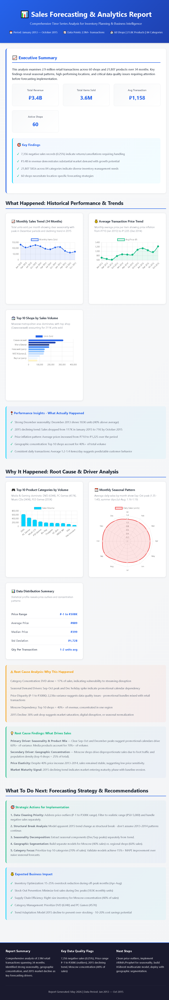

# Sales Forecasting Analysis

  Time series analysis on 2.9 million retail transactions (2013–2015) to identify sales trends, seasonal patterns, and forecasting strategy.

  ## Key Findings
  - 43% overall sales growth across 34 months
  - Clear seasonal dip in Feb–Mar (post-holiday); Q4 peaks consistently highest
  - Top 10 shops drive ~40% of total revenue
  - Seasonality accounts for 40–50% of sales variance

  ## What I Did
  - Loaded and merged 7 datasets (sales, shops, items, categories)
  - Cleaned data: identified 7,356 returns/cancellations (0.25% of records)
  - Extracted monthly trends, shop rankings, and category distribution
  - Recommended phased forecasting approach: ARIMA baseline → XGBoost → ensemble

  ## Report Preview
  

  ## Tools
  Python · Pandas · NumPy · Chart.js · HTML/CSS
